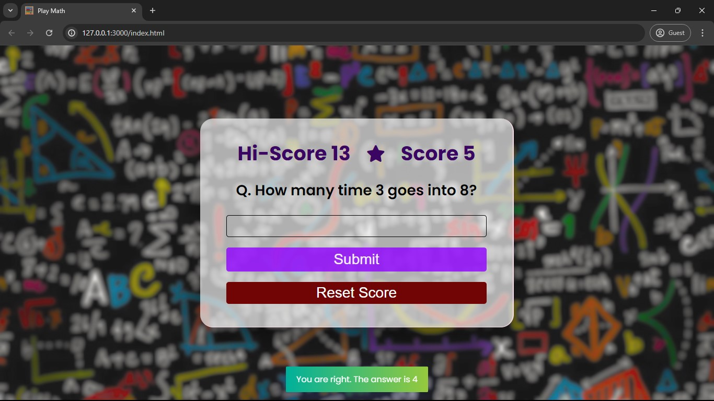

# Play Math

Play Math is an interactive web-based game designed to enhance your arithmetic skills. It generates random math questions, allowing you to test and improve your basic math operations in a fun and engaging way.

To view this project, visit [here](https://aimless-coder.github.io/Play_Math/)

## Table of Contents

- [Demo](#demo)
- [Features](#features)
- [Installation](#installation)
- [Usage](#usage)
- [Acknowledgement](#acknowledgement)
## Demo




## Features

- Dynamic Question Generation: Randomized questions covering addition, subtraction, multiplication, division, modulus, and squares.
- Score Tracking: Real-time score updates and high score storage using local storage.
- Visual Feedback: User feedback using Toastify to indicate correct or incorrect answers.
- Responsive Design: Adaptable to different screen sizes, ensuring an optimal experience on both desktop and mobile devices.


## Installation

To get a local copy up and running follow these simple steps:

1. Clone the repository:
   ```sh
   git clone https://github.com/aimless-coder/Play_Math.git
   ```

2. Open `index.html` in your browser

    
## Usage

- Start Playing: Upon loading, the app displays a math question. Enter your answer in the input field and submit.
- Score Tracking: Correct answers increase your score, while incorrect answers decrease it.
- High Score: The highest score achieved is stored in your browser’s local storage and displayed during your session.
- Reset Score: Click the "Reset Score" button to reset your current score to zero.


## Acknowledgements

 - [toastify-js](https://github.com/apvarun/toastify-js) : A lightweight JavaScript library to show toast notifications.


